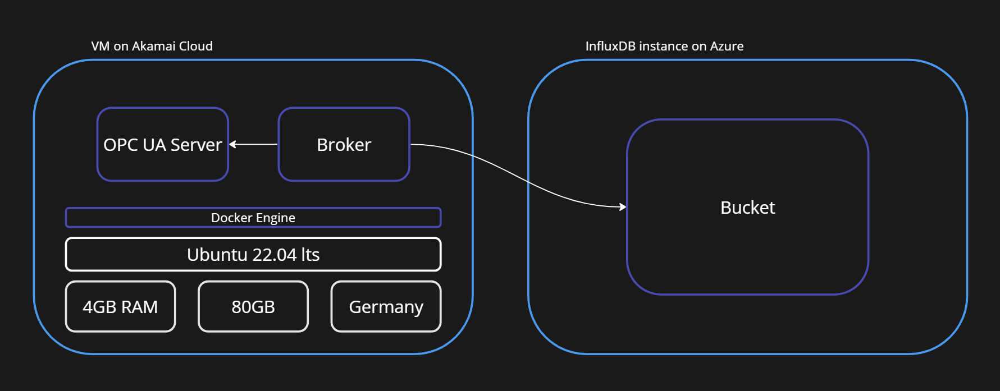

# OPC UA and InfluxDB Test
This is a simple test to show how to connect an OPC UA server to an InfluxDB database. The test is intended to work with an original set of data from an industrial machine.

## Overview
This projects consists of three parts:
1. OPC UA Server: This element simulates a sensor and sends out data according to the data structure from the industrial machine.
2. Broker: This element is a simple OPC UA client that retrieves data from the server and sends it to the InfluxDB database.
3. InfluxDB: This is a time-series database that stores the data sent by the broker.

## Security
No element is publicly accessible. Access is granted through personal request. If you are interested, please ask a question in the discussion section.

## Infrastructure
The OPC UA Server is a Docker container on a VM in the Akamai Cloud. The broker is another Docker container on the same VM. The InfluxDB is a managed service on Azure, accessible through Influxdata's web app.

## Languages and dependencies
The OPC UA Server is written in Python and uses the `asyncua` library. The broker is also written in Python and uses the `asyncua` and `influxdb` libraries. The InfluxDB is fully managed.

